# Security Hardening and Traffic Analysis

## Harden the OpenWRT System

This section documents the four hardening steps that we applied to our OpenWRT virtual machine. For each and every step, we have recorded the state before the changes were made, the commands or actions which are used to apply the change, and the resulting state after the change. We also explain the security risk that each step addresses.

---

### Step 1: Change Default Credentials

**Security risk addressed:** The OpenWRT loads without a root password by default. Any user who can reach the router — whether through the network or through the VirtualBox console — would have an immediate and unrestricted root access to the system. Setting-up a strong password is the fundamental protective measure on any network device.

**Before:** The router has no root password set at the time of first boot. This was the default state after the installation — any person connecting via SSH or the VirtualBox console could issue commands as root without entering any credentials.

**Change applied:** We ran the `passwd` command in the OpenWRT terminal to set a new root password and the output has been confirmed that the password has been changed successfully.

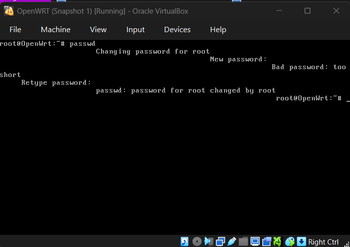

**After:** The root account now requires a password before any terminal or SSH session is permitted. Any other kinds of attempts to connect through SSH without the correct password gives the results in an authentication failure.

---

### Step 2: Examine the Password Storage

**Security risk addressed:** If a system stores passwords in plaintext, any unauthorised user who gains read access to `/etc/shadow` would immediately get every user's password. Modern systems hash passwords with a one-way cryptographic function so that, even if the file is compromised, the actual passwords cannot be read directly. An attacker would have to crack the hashes using brute-force or dictionary attacks, which is computationally expensive.

**What we did:** We have ran `cat /etc/shadow` to see the contents of the shadow password file on OpenWRT and identify the hashing algorithm used.

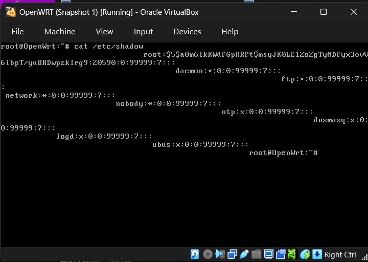

**Findings:** At most of time the root entry in the shadow file will begins with the hash `$5$a0m6ikKWdFGpRRPt$...`. The `$5$` prefix identifies the algorithm as the **SHA-256** . The format of the hash will be like:

```
$<algorithm-id>$<salt>$<hash>
```

The SHA-256 is one of the secure and one-way hashing function. It is computationally Impractical to reverse a SHA-256 hash to recover the original plaintext password. The salt value (`a0m6ikKWdFGpRRPt` in this case) ensures that even if there are two users had the same password, their hashes would look completely different and preventing the pre-computed rainbow table attacks.

**Why hashing matters:** A system that stored `password123` as plaintext in a file will be immediately compromised the moment when that file was read by an unauthorised user. With SHA-256 hashing and a random salt when an attacker who reads the shadow file would need to run millions of permutations and combinations of guesses through the same hash function and compare results, which takes more time even with modern hardware.

---

### Step 3: Set Up a SSH Key-Based Authentication System

**Security risk addressed:** The Password-based SSH authentication is vulnerable to brute-force attacks where an attacker systematically tries thousands of common passwords from which the attacker can find the password. THe Key-based authentication replaces the password with a cryptographic key pair where a public key stored on the router and a private key is kept only on the administrator's machine. Without the matching private key so no one can log in and regardless of how many password guesses they tried.

**Step 3a — Generate the RSA key pair using PuTTYgen:**

We first open the `PuTTYgen` (which was installed alongside PuTTY on the Windows host) to generate the key pair.

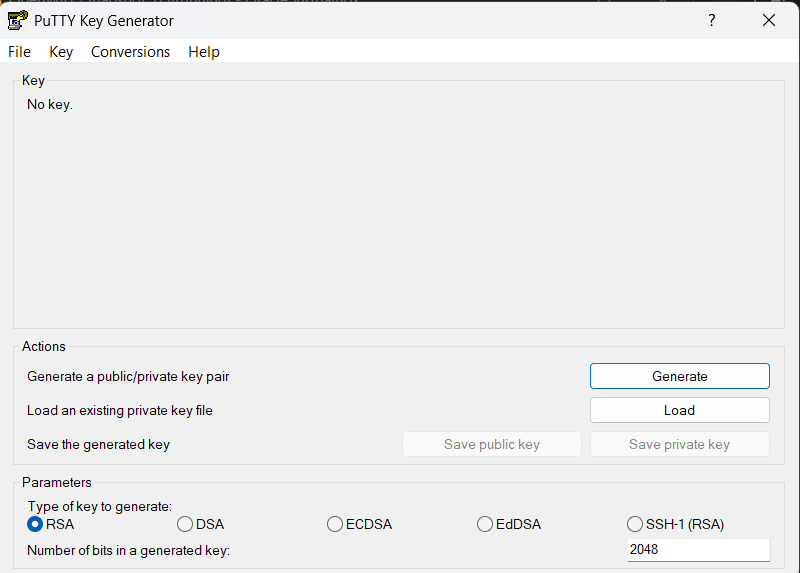

We keep the key type as RSA and clicked **Generate**, then we have moved the mouse randomly in the blank area to produce the entropy needed for key generation. The key generation is completed and displayed in our new public key.

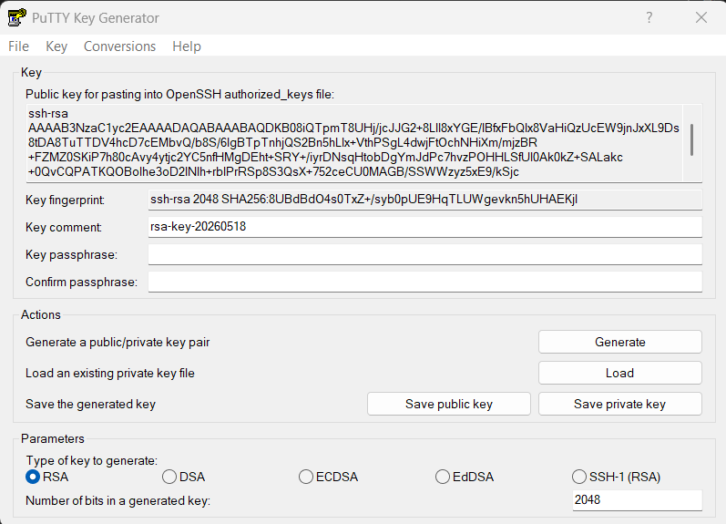

We have saved the private key as a `.ppk` file in the Windows machine. The public key text is shown in the text box is what we needed to add to the router.

**Step 3b — Add the public key to OpenWRT via LuCI:**

We have opened the LuCI web interface at `http://192.168.56.2:81` in the browser and we have navigated to **System → Administration → SSH-Keys**.

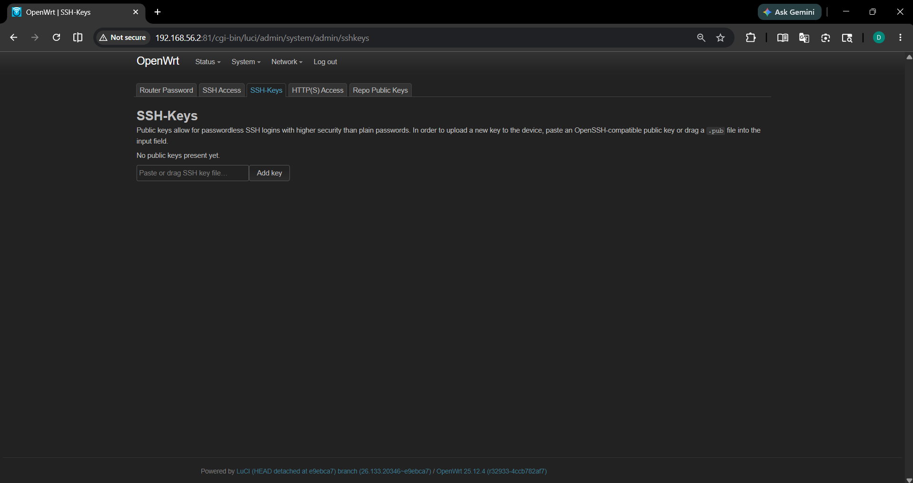

We have pasted the public key text copied from PuTTYgen into the text field.

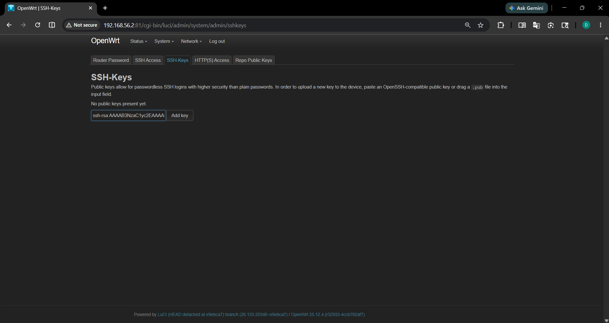

After clicking the **Add key** button and then **Save & Apply** button the key appeared in the list confirming it had been stored on the router.

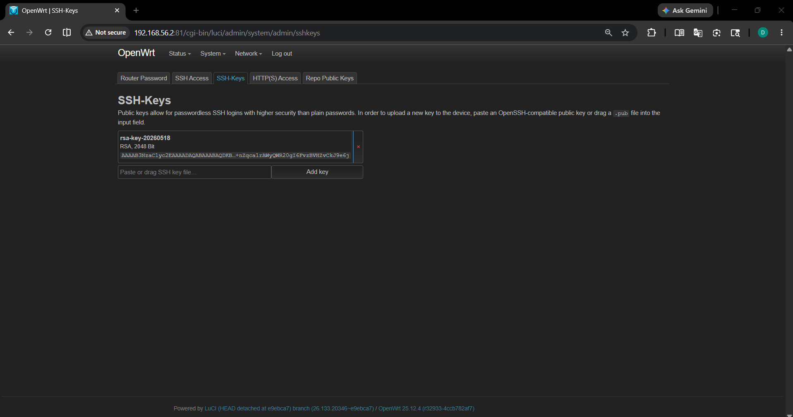

**Step 3c — Test key-based login using PuTTY:**

We have opened the PuTTY and configured it to connect to `192.168.56.2` on port `2222`. Under the path **Connection → SSH → Auth → Credentials**, we have browsed to and selected the private key file. After clicking **Open** the PuTTY connected and has displayed the login prompt.

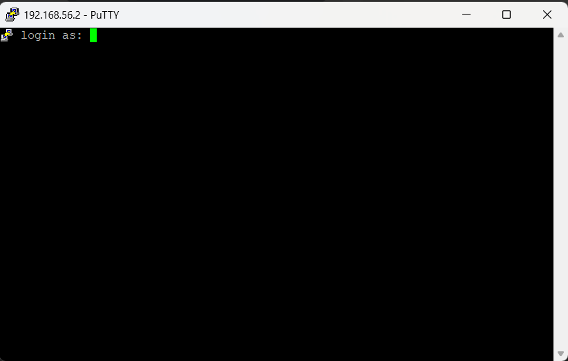

We have typed `root` at the login prompt. The session authenticated immediately using the key, displays the OpenWRT shell without asking for a password.

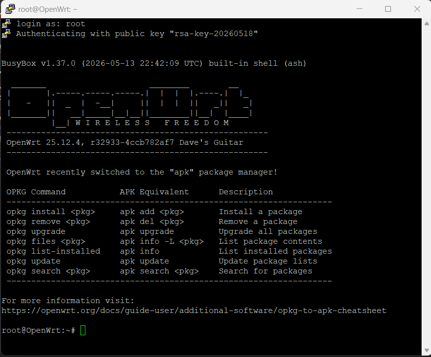

**Why the key-based authentication is more secure than passwords:** Aa a `2048-bit` RSA private key contains the equivalent of roughly `617` decimal digits of randomness and due to this the Brute-forcing it is not practically possible with any current or near-future computing technology.And in contrast that even a moderately complex password can often be cracked with dictionary attacks or can be compromised through phishing attacks. In Addition when the private key never leaves the administrator's machine — it is never transmitted over the network during authentication and unlike a password which is checked against the server.

---

### Step 4: Disable Unnecessary Services

**Security risk addressed:** Every service that is running on a router or server represents a potential attack surface. If a service has an unpatched vulnerability that an attacker can exploit it even if the service is not directly needed. Disabling any service that the organisation does not need removes that attack surface entirely. This principle is known as minimising the attack surface.

**Before — listing all enabled startup services:**

We have ran the following command to list all services that were configured to start automatically when the router boots.

```bash
ls -l /etc/rc.d/S*
```

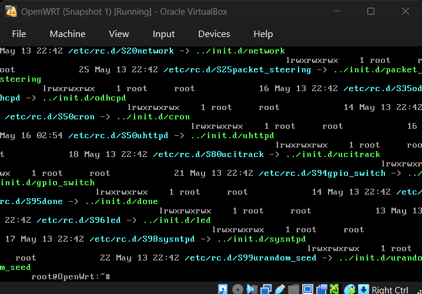

We have reviewed the list and identified **sysfixtime** as a service that is unnecessary for our the scenario. The `sysfixtime` service attempts to correct the system clock on the devices that lack a real-time clock (RTC) hardware chip by reading timestamps from the filesystem and Our OpenWRT VM runs inside VirtualBox which synchronises the guest clock with the Windows host automatically. Running `sysfixtime` provides no benefit and only adds an extra process that starts at boot time.

**Check the status before disabling:**

```bash
/etc/init.d/sysfixtime enabled && echo "Enabled" || echo "Disabled"
```

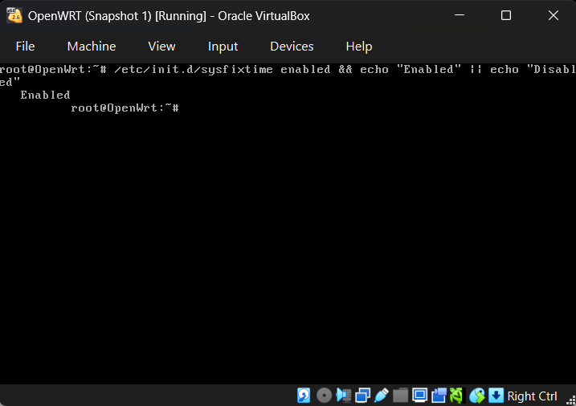

**Disabling the service:**

```bash
/etc/init.d/sysfixtime stop
/etc/init.d/sysfixtime disable
```

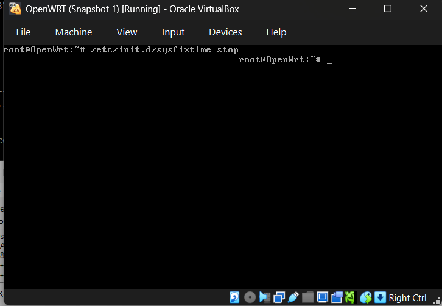

**Verifying the service is now disabled:**

We have then ran the status check command again to confirm the change had taken effect.

```bash
/etc/init.d/sysfixtime enabled && echo "Enabled" || echo "Disabled"
```

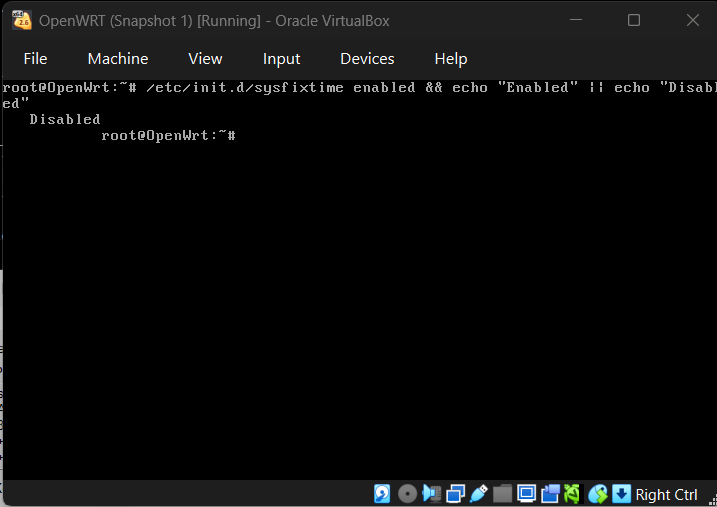

**Why this improves security:** Every piece of the software running on a system is code that may contain bugs and including security vulnerabilities. Then Disabling `sysfixtime` removes one executable from the boot sequence. While this particular service is low-risk, the practice of reviewing and removing the unnecessary services is an important habit in hardened system administration. When on a real business router and services such as Telnet (which transmits the credentials in plaintext) and unused VPN daemons or the diagnostic tools left enabled from a development build would all be candidates for disabling.

---

## Traffic Analysis

This section documents two network traffic captures performed on the `OpenWRT` router using `tcpdump`. The first capture records HTTP traffic to the business website. The second capture records an `SSH` session. Both captures were transferred to the Windows host and analysed in Wireshark.

The `.pcap` files are included in this repository:
- [/captures/http_capture.pcap](/captures/http_capture.pcap)
- [/captures/ssh_capture.pcap](/captures/ssh_capture.pcap)

---

### Preparation — Installing tcpdump

when before capturing traffic we have installed `tcpdump` on the OpenWRT router. This is a command-line packet capture tool that records the network traffic passing through a specified interface and then saves it to a `.pcap` file.

```bash
apk add tcpdump
```

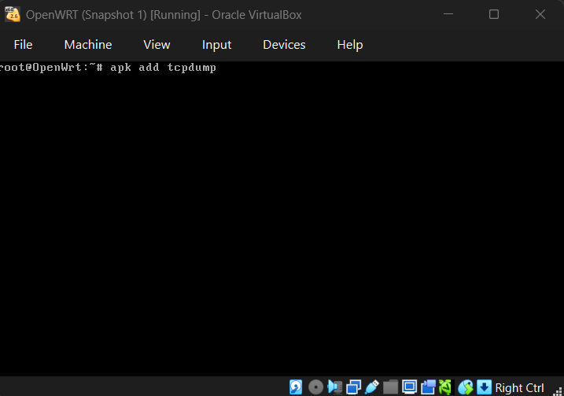

Then we also reset the firewall rules and then ensured the web server was back on port `80` before starting the capture, so that we could generate clean HTTP traffic.

---

### Capture 1 — HTTP Traffic

#### 1. Capturing the Traffic

When we have started as capture on the `br-mng` interface and filtering for traffic on port 80 only and writing the output to a file in `/tmp/`:

```bash
tcpdump -i br-mng -w /tmp/http_capture.pcap port 80
```

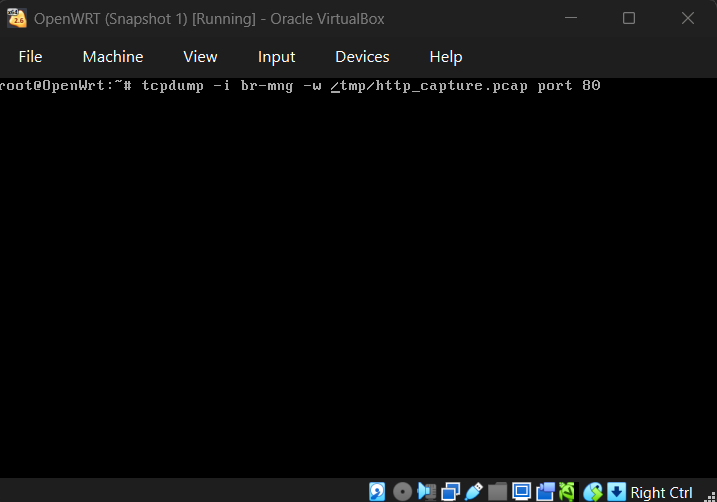

With the capture running and we have switched to the Windows host browser and navigated to `http://192.168.56.2`. We refreshed the page two to three times to generate enough HTTP request and response packets in the capture.


We have then returned to the OpenWRT terminal and pressed **Ctrl+C** to stop the capture.

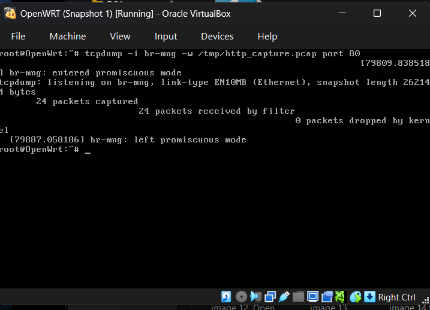

#### 2. Transferring the Capture File to Windows

We installed the SFTP server on OpenWRT to allow secure file transfer:

```bash
apk add openssh-sftp-server
```

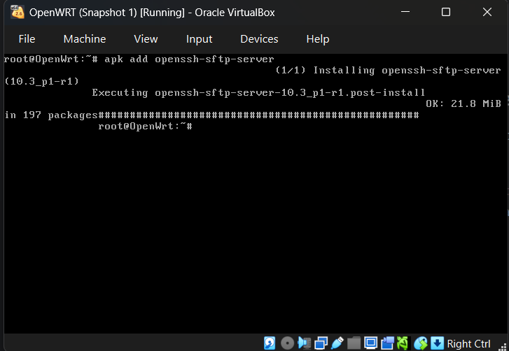

We have then opened PowerShell on the Windows host and ran SCP to copy the file:

```powershell
scp -O -P 2222 root@192.168.56.2:/tmp/http_capture.pcap C:\Users\vishu\Desktop\
```

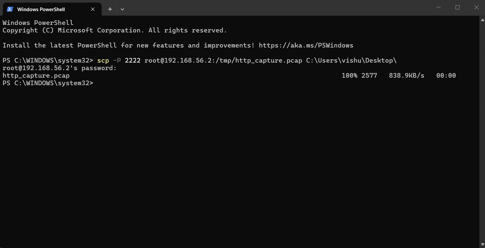

#### 3. Analyse the Capture in Wireshark

We have opened Wireshark on the Windows host and then we have loaded the `http_capture.pcap` file by opening it.

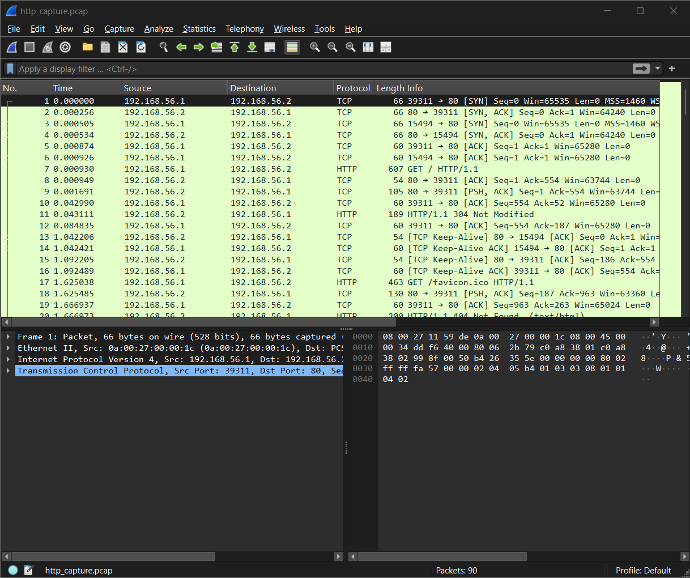

We have typed `http` in the display filter bar and pressed Enter to show only the requested HTTP packets.

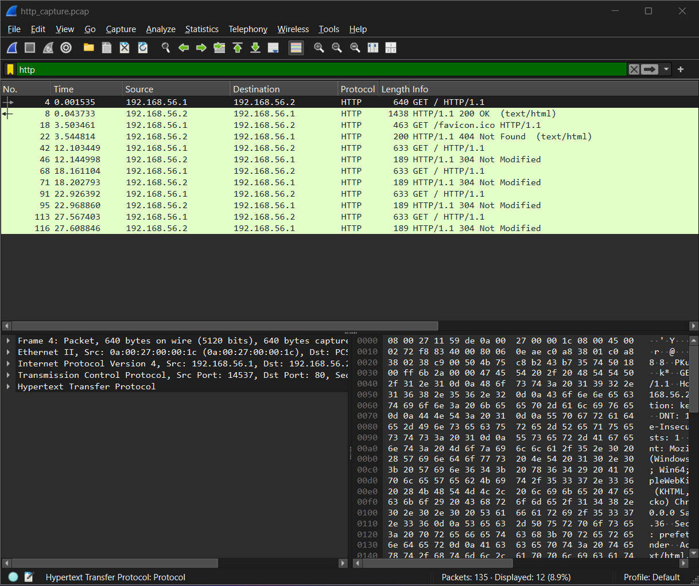

The filtered view shows multiple HTTP exchanges. Where the source `192.168.56.1` is the Windows host and the destination `192.168.56.2` is the OpenWRT router. The list includes `GET /` requests and `HTTP/1.1 200 OK` responses, confirming the page have been loaded successfully during the capture window.

We have clicked on one of the `HTTP/1.1 200 OK (text/html)` packets in the list, then right-clicked and selected **Follow → HTTP Stream**.

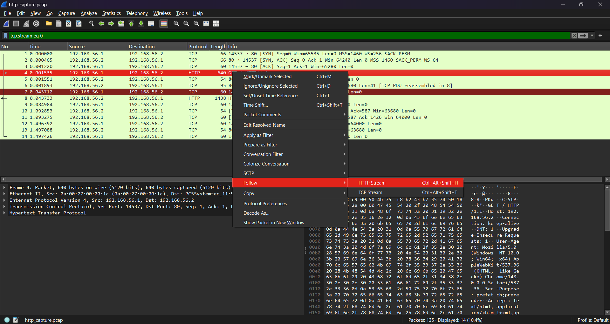

#### 4. What is Visible in the Captured Packets

The Following HTTP Stream window was opened and then displayed the complete unencrypted HTTP conversation:

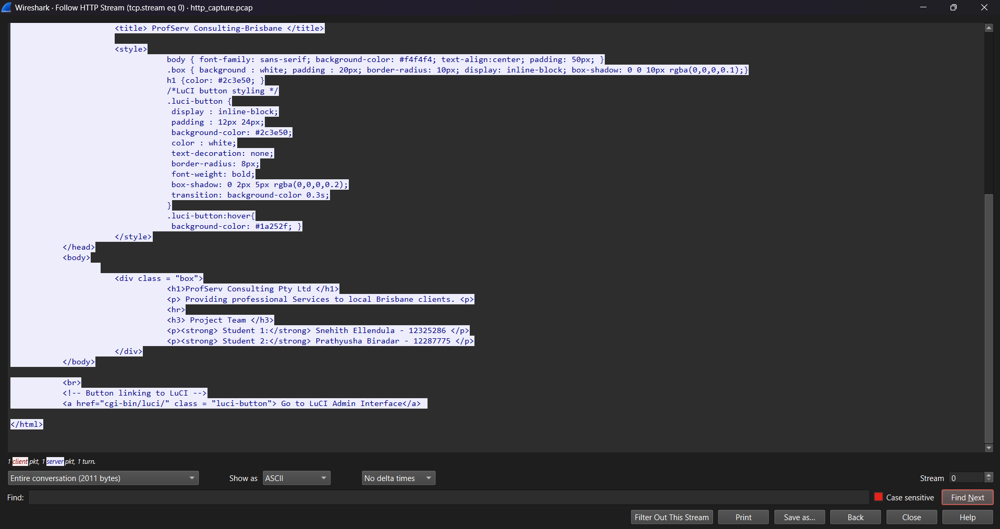

The stream view will reveal the following information completely in plaintext, with no encryption or obfuscation:

- The **HTTP request headers** which was sent by the browser that includes the `User-Agent` string (identifying it as Chrome 148 on Windows 10), the `Accept` headers, and the `Accept-Language` set to `en-IN,en-GB`.
- The **HTTP response headers** from the server, including the server date in the `Content-Type: text/html`, and the `Content-Length: 746`.
- The **complete HTML source code** of the business website which includes the page title `ProfServ Consulting-Brisbane`and the business description and the student name and ID fields in the page body.

**Security implications of unencrypted HTTP:** Any attacker who can intercept network traffic between a client and this web server — for example, someone connected to the same local network and an attacker who has compromised a router between the two endpoints or a malicious ISP that can see exactly what was just visible in the Wireshark stream window. The attackers does not need any specialised tools beyond `tcpdump` and Wireshark, both of which are freely available.

For a business that handles the client legal documents and their personal information and serving those pages over plain HTTP means that has sensitive data could be read by anyone able to capture traffic on the network path. This is the exact vulnerability we identified as highest-risk in our risk assessment and it is why enforcing HTTPS with TLS is the primary security control we recommend.

---

### Capture 2 — SSH Traffic

#### 1. Capturing the Traffic

We have started a new capture on the `br-mng` interface and this time filtering for port `2222`, which is the port our OpenWRT SSH service was changed to in the firewall configuration step.

```bash
tcpdump -i br-mng -w /tmp/ssh_capture.pcap port 2222
```

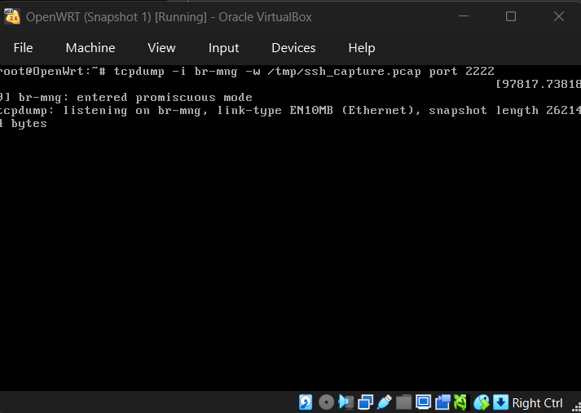

With the capture running, we opened PuTTY on the Windows host and connected to `192.168.56.2` on port `2222` using our private key.

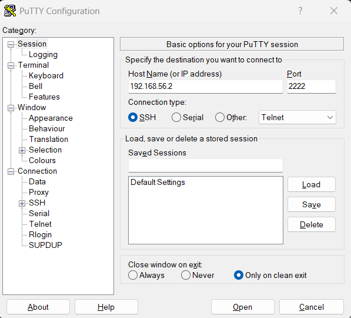

After logging in as a root, we ran a few commands to generate SSH session traffic:

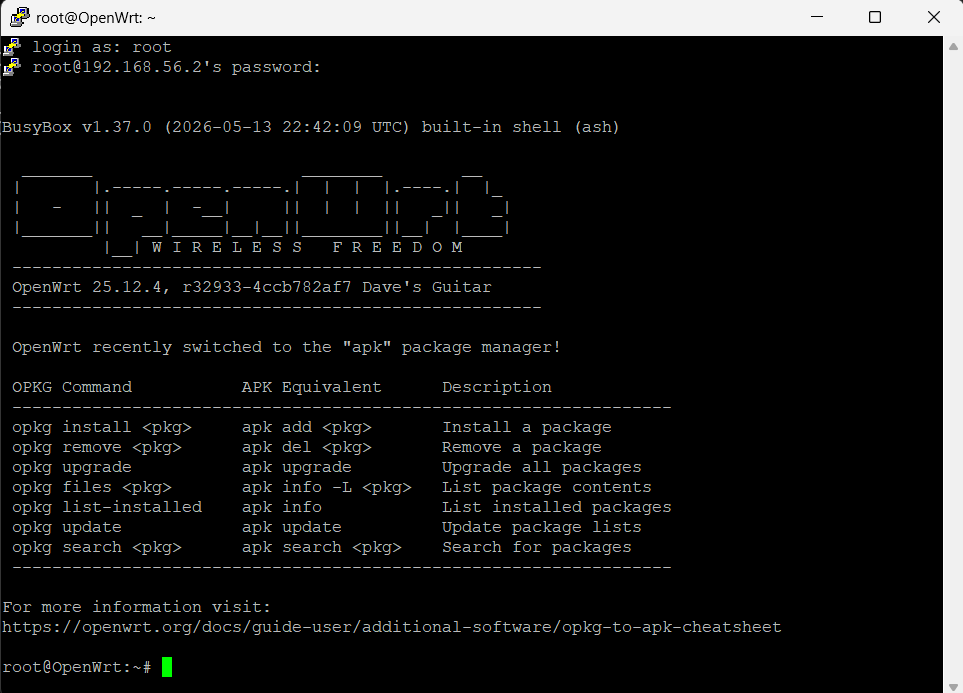

We entered `ls` to list files and then `exit` to close the session.

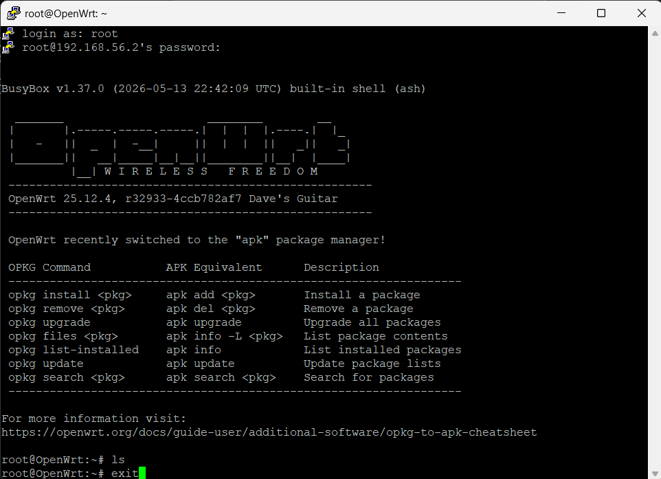

We have returned to the OpenWRT terminal and pressed **Ctrl+C** to stop the capture.

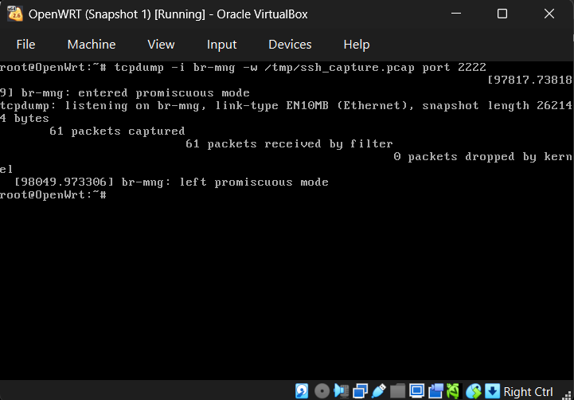

#### 2. Transferring and Analysing the SSH Capture

We have transferred `ssh_capture.pcap` to the Windows host using the same SCP method as before.

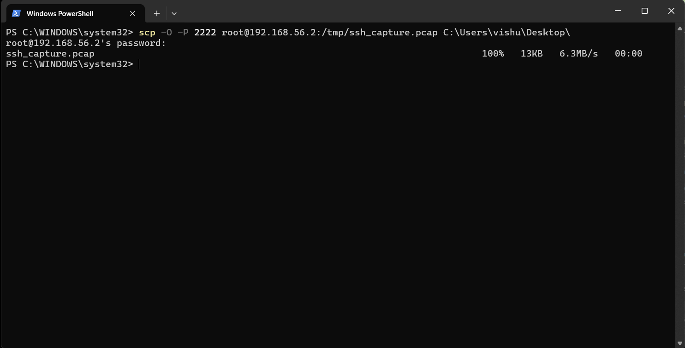

We have opened the file in Wireshark and applied the `ssh` display filter.

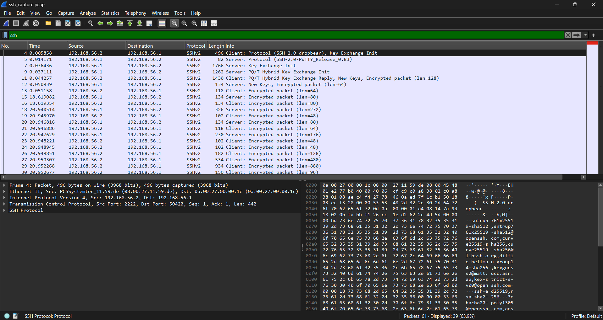

#### 3. What is  Visible in the SSH Capture

The Wireshark packet list shows the SSH version 2 (SSHv2) packets exchanged between `192.168.56.1` (Windows host) and `192.168.56.2` (OpenWRT router) on port 2222.

The first few packets shows the **key exchange handshake** — the client and server negotiating which cryptographic algorithms to use. This is the only unencrypted phase of the SSH connection. After the handshake completes, every subsequent packet is labelled `Encrypted packet (len=...)`.

When we have clicked on one of the encrypted packets and then expanded the SSH Protocol section in the bottom panel and the payload showed only unreadable binary data. There was no plaintext visible — not the commands we typed (`ls`, `exit`), not the shell output, not the username. Everything transmitted after the initial handshake was encrypted.

#### 4. Comparison with HTTP and Why Encrypted Protocols Matter

The contrast between the two captures demonstrates the core difference between encrypted and unencrypted protocols:

| Aspect | HTTP Capture | SSH Capture |
|--------|-------------|-------------|
| Protocol | HTTP (plaintext) | SSHv2 (encrypted) |
| Request content | Fully visible in ASCII | Not visible — encrypted |
| Response content | Full HTML source readable | Not visible — encrypted |
| Business name and student details | Clearly readable | Not visible |
| Source and destination IPs | Visible | Visible |
| Port numbers | Visible | Visible |
| Data content | Completely exposed | Completely hidden |

An attacker who captures HTTP traffic can read the webpage content, can extract student names, IDs, business information, and HTTP headers without any decryption. An attacker who captures SSH traffic can confirm that a connection was made between two IP addresses on port 2222, but cannot read any of the commands typed and the output returned or any credentials used during the session.

This is exactly why encrypted protocols are essential for protecting data in transit. For the business website in this project the implication is clear: as long as the site is served over HTTP and any client who accesses it on an untrusted network is exposing their browsing activity and any data visible on the page and Migrating to HTTPS would encrypt the entire HTTP conversation in the same way SSH encrypts terminal sessions, making eavesdropping computationally infeasible.
